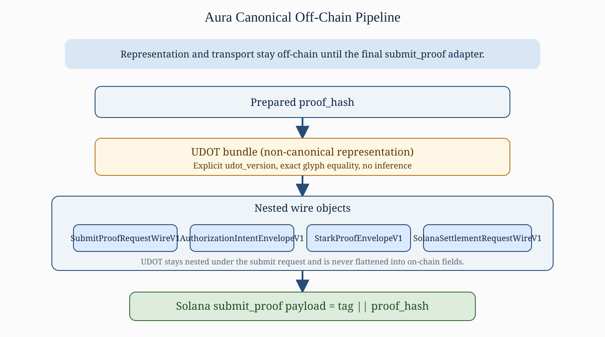
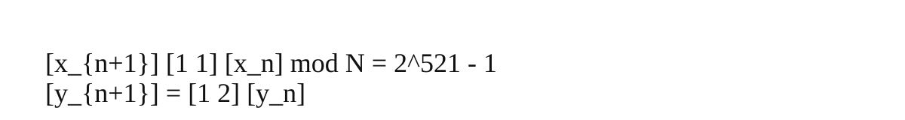
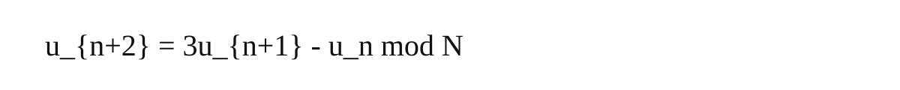
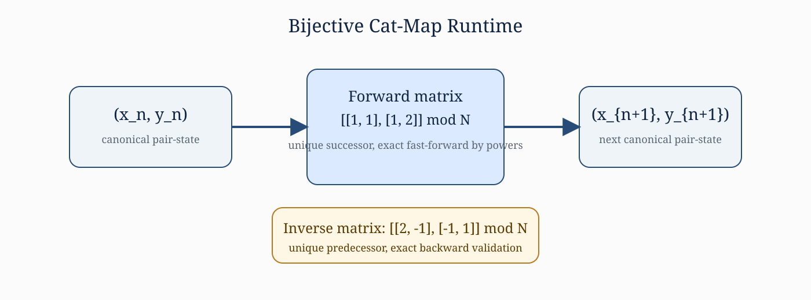
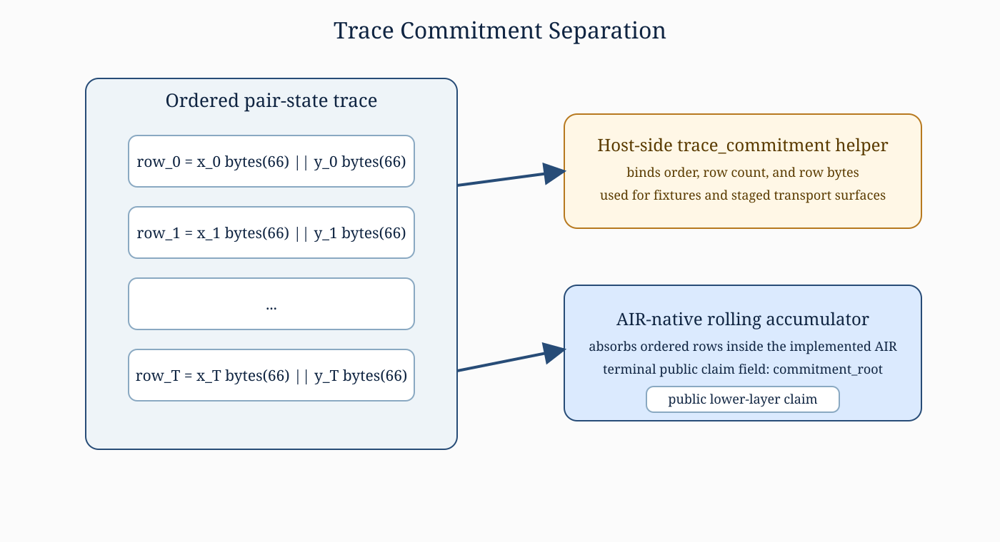
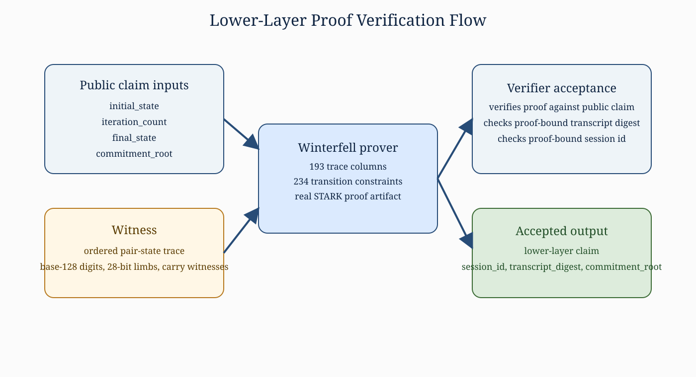
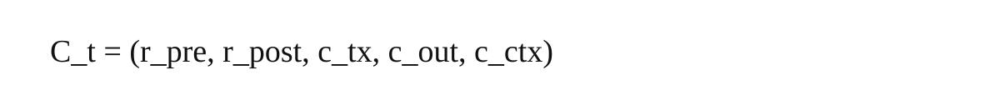

<!-- DOC_STATUS_HEADER_START -->
> Status: HISTORICAL (SUPERSEDED)
> Concept: Aura: A Commitment-Native Post-Quantum Layer 2 with Bijective Runtime Identity and Typed STARK Commitments
> Scope Boundary: Historical snapshot retained for traceability only. It is superseded and must not be used as current protocol, package, fixture, or repository authority.
> Replaced By: [Aura: A Commitment-Native Post-Quantum Layer 2 with Bijective Runtime Identity and Typed STARK Commitments](../../AURA_WHITEPAPER_FINAL.md)
> Commitment Doctrine: [Aura 521-Bit Deterministic Commitment Doctrine V1](../../docs/AURA_521_BIT_DETERMINISTIC_COMMITMENT_DOCTRINE_V1.md)
> Interpretation Rule: Read the body as historical context only. Follow the replacement document for current authority.
> Implementation State: Superseded.
<!-- DOC_STATUS_HEADER_END -->

# Aura: A Commitment-Native Post-Quantum Layer 2 with Bijective Runtime Identity and Typed STARK Commitments

**Author:** Tyler McRae

## Abstract

Aura is best understood as a layered commitment system rather than as a single undifferentiated rollup artifact. The repository currently implements three aligned but distinct surfaces: a frozen Aura v1 proof-hash submission path in which Solana records only proof_hash; a lower-layer bijective runtime in which the Arnold cat map over Aura's fixed 521-bit Mersenne prime modulus drives deterministic pair-state execution, canonical trace handling, native lineage construction, and a real Winterfell-backed STARK path; and a typed Layer 2 transition-binding contract whose core public tuple binds pre-state, post-state, transaction, outcome, and batch-context commitments. This paper restates the implemented mathematics, proof boundary, binding model, and UDOT representation layer without upgrading unimplemented subsystems into present-tense claims.

The paper distinguishes cryptographically verified statements from host-side transport and binding logic. The lower-layer STARK path proves the non-native cat-map trace and its AIR-native commitment root, while nested submit, intent, proof, and settlement envelopes remain explicit host-side objects with byte-exact Rust and TypeScript parity. UDOT is treated strictly as a non-canonical representation derived from the same proof_hash and carried off-chain through the canonical pipeline. Repository benchmark measurements taken on March 27, 2026 report a 32-step canonical instance at about 14.0 seconds proving time and about 20.6 milliseconds verification time, and a 128-step structured instance at about 62.7 seconds proving time and about 21.7 milliseconds verification time, under the current dev-profile harness. The result is a publication-ready statement of Aura's implemented commitment, proof, and transport surfaces.

**Keywords:** Arnold cat map, STARK, non-native AIR, typed commitments, authorization lineage, UDOT, Solana settlement adapter

## System Overview

Aura presently exposes four separated layers. The math layer is the cat-map runtime over Aura's fixed 521-bit Mersenne prime modulus. The proof layer is the Winterfell-backed STARK system that proves the lower-layer non-native trace relation and exports an AIR-native commitment root. The binding layer packages typed commitments, including the native authorization lineage family and the frozen Layer 2 transition tuple. The representation layer is the UDOT surface and the nested off-chain wire envelopes that transport proof_hash-derived artifacts without changing their cryptographic meaning.

A separate supporting research note, AURA_DODECAHEDRAL_EMA_NOTE_V1.md, addresses the unbounded-input bottleneck by placing a 20-node dodecahedral EMA sharding surface upstream of cat-map seed reduction. In that construction, an unbounded stream is first compressed into bounded node-local states and only then reduced into the canonical initial pair (x_0, y_0). The note is intentionally non-authoritative: it does not alter the cat-map transition law, the ordered trace-commitment model, the AIR statement, the proof boundary, or the UDOT derivation contract.

The production canonical pipeline is frozen and now has no deferred serialization boundary: prepared proof_hash, canonical UDOT bundle, SubmitProofRequestWireV1, AuthorizationIntentEnvelopeV1, StarkProofEnvelopeV1, and SolanaSettlementRequestWireV1. Cross-language fixtures pin this exact nesting and exact minified JSON bytes in both Rust and TypeScript. The chain-facing Solana instruction still carries only tag || proof_hash, which keeps the settlement adapter compact while leaving richer envelopes off-chain.

*Figure 1. Frozen Aura production pipeline. UDOT remains nested off-chain through the submit, intent, proof, and settlement envelopes, while the final Solana instruction submits only tag || proof_hash.*

This architecture is commitment-native because each layer consumes typed commitments from the layer below rather than reparsing or inferring semantics from presentation artifacts. It is also intentionally conservative: representation data does not become proof data, proof data does not silently redefine transport, and host-side adapters do not claim verifier authority they do not actually hold.

## Mathematical Foundation

The authoritative lower-layer runtime is the Arnold cat map over Aura's fixed Mersenne prime modulus. Aura interprets state as an ordered pair over that modulus and advances the pair by a deterministic linear rule. In the 521-bit runtime crate, seed bytes are reduced deterministically into field elements, so the initial pair is a deterministic function of the supplied entropy and challenge bytes rather than an inferred or presentation-dependent object.

*Figure 2. Matrix form of the Aura lower-layer cat-map update over the fixed Mersenne prime modulus.*

Each coordinate sequence also satisfies a second-order linear recurrence. That recurrence is used throughout the repository as a compact way to reason about consistency of trace transitions, fast-forward equivalence, and inverse-path validation.

*Figure 3. Coordinate recurrence induced by the cat-map update rule.*

Bijectivity is the critical structural property. The update matrix has determinant one, so every state has exactly one predecessor and one successor, and the inverse matrix is explicit. Aura therefore replaced the earlier dissipative quadratic map with a volume-preserving pair-state runtime that supports exact backward validation and logarithmic-time jumping by matrix powers.

*Figure 4. Bijective cat-map state transition. Forward and inverse maps are both explicit, so each state has a unique predecessor and successor.*

## Trace Commitment Model

The lower-layer trace is the ordered sequence of pair states from the initial state through the terminal state. Each canonical row is serialized as x_bytes_66 || y_bytes_66, which fixes a 132-byte row format for the 521-bit runtime. The host-side trace commitment helper binds row order, row count, and both coordinates at every step.

The active proof path intentionally distinguishes the host-side trace helper from the AIR-native commitment root. In current implementation, the proof statement exports commitment_root as the public lower-layer claim field, while trace_commitment remains a deterministic auxiliary commitment used for fixtures, staged surfaces, and bridge-layer structure. This separation is necessary to keep the proof layer and the host transport layer from drifting into each other.

*Figure 5. Lower-layer trace structure. The host-side trace_commitment helper and the AIR-native rolling commitment root are related but intentionally distinct surfaces.*

The repository is explicit about this boundary: the current STARK path proves the ordered trace and its AIR-native rolling accumulator, but it does not claim that the retained host-side trace_commitment hash helper is itself enforced inside the AIR. That distinction is not a defect; it is part of the repository's declared proof boundary.

## STARK Proving System

Aura's implemented lower-layer prover uses Winterfell. Because Winterfell does not natively operate over Aura's fixed 521-bit modulus, the active AIR uses an explicit non-native bridge. Each 521-bit coordinate is decomposed into base-128 digits and grouped into 28-bit arithmetic limbs with carry witnesses. This preserves exact 521-bit cat-map semantics while remaining compatible with the backend field.

The active optimized AIR shape is fixed at 193 trace columns and 234 transition constraints, with 19 arithmetic limbs per coordinate and 18 carry witness columns per coordinate. The public lower-layer claim contains initial_state, iteration_count, final_state, and commitment_root. The witness is the full ordered pair-state trace. Deterministic transcript and session packaging layers then bind the lower-layer claim, public claim, witness bundle, recurrence summary, and proof-bound session identifiers into verifier-visible artifacts.

*Figure 6. Proof generation and verification flow for the implemented lower-layer STARK path.*

The repository's negative claims are as important as its positive ones. The current proof system does not claim native backend-field equality to 2^521 - 1, recursive composition, or AIR-level enforcement of the retained host-side trace_commitment helper. The active statement is narrower and therefore stronger: Winterfell proves the implemented non-native cat-map AIR and verifies it against the exact claim object carried by the lower-layer session package.

## Binding Model

Aura's binding layer is typed. The frozen Layer 2 transition-binding contract defines one exact transition tuple whose elements are not inferred from transport objects or narrative descriptions. The tuple below is the core binding surface used by the active 13-field, 284-byte public-input envelope of the verified Layer 2 foundation.

*Figure 7. Typed Layer 2 transition tuple used by the frozen public-input schema.*

Here r_pre and r_post are the committed pre-state and post-state roots, c_tx commits the ordered canonical transaction list, c_out commits the ordered canonical execution outcomes, and c_ctx commits the deterministic batch context not already contained in the pre-state or transaction list. The repository treats this tuple as a logical core of the wider settlement-facing public envelope rather than as an informal design sketch.

This typed binding model is kept separate from the lower-layer cat-map claim. The cat-map proof path proves runtime identity and trace evolution; the Layer 2 tuple binds batch execution claims. Aura's documentation treats both as commitment surfaces, but it does not silently collapse them into one object. That separation is essential to preserve exact semantics at each layer.

## UDOT Representation Layer

UDOT is the representation layer, not the canonical cryptographic commitment. In version 2, the required output object contains format_version, aura_hash_bytes, seal_line, crest, matrix_sequence, and matrix_form. These values are deterministically derived from the same 32-byte aura_hash input by domain-separated hash derivations and fixed glyph mappings.

The implementation contract is explicit that UDOT is NON-CANONICAL. It is a display and transport surface derived from the authoritative hash; it is not a substitute for proof_hash, not an AIR public input, and not the on-chain settlement payload. Exact code point equality matters, whitespace is rejected in canonical validation paths, and udot_version remains explicit rather than inferred. The canonical production fixtures pin version 2 and reject silent normalization in both Rust and TypeScript.

In the production pipeline, UDOT stays nested under the submit request and remains nested through the intent, proof, and settlement envelopes. Solana never sees the UDOT payload. The chain-facing adapter still receives only proof_hash, which is why the representation layer must be described as non-canonical even when it is byte-exact and fixture-backed.

## Security Model

### What Is Verified

The repository's verified statements are implementation-specific and intentionally narrow. In the lower-layer runtime, the code verifies exact cat-map forward and inverse transitions, recurrence consistency, deterministic seed reduction, canonical pair-state serialization, and the real Winterfell-backed STARK acceptance path for the non-native AIR claim. In the frozen production pipeline, the repository verifies exact byte-level equality for canonical wire objects across Rust and TypeScript and rejects missing fields, non-canonical hex, mismatched nested bundles, and broken envelope nesting fail-closed.

- The lower-layer STARK proves initial_state, iteration_count, final_state, the exact ordered non-native trace relation, and the AIR-native commitment_root.
- The verified Layer 2 foundation fixes a 13-field, 284-byte public-input envelope whose typed transition core is the five-field binding tuple shown above.
- The production UDOT-to-L4 path now has a fixture-backed guarantee that there is no remaining deferred boundary in the canonical pipeline.

### What Is Not Claimed

Aura also records several explicit non-claims. The current repository does not claim that the backend field itself equals Aura's fixed modulus, that recursive composition is implemented, that the retained host-side trace_commitment helper is enforced inside the AIR, or that Solana verifies proof semantics on-chain. The post-quantum claim is limited to the STARK proving layer under standard hash-based assumptions; it does not automatically extend to classical host-side components such as Ed25519-bound subject identifiers, base58 transport fields, or the surrounding Solana infrastructure.

- UDOT is not a proof object and does not replace proof_hash.
- Nested submit, intent, proof, and settlement envelopes are host-side transport and binding objects, not verifier objects.
- The current paper does not claim token issuance, burn, staking, or any broader economics beyond fee surfaces already named in repository contracts.
- The current paper does not claim that Aura's future Layer 2 settlement system is already implemented end to end beyond the frozen proof_hash submission adapter.

## Performance Notes

The repository includes a checked-in benchmark harness for the real lower-layer STARK path. On March 27, 2026, the benchmark was run directly from crates/aura_intent_lineage_v1/tests/stark_benchmark_v1.rs under the current dev-profile test configuration. These numbers are implementation measurements, not throughput claims about a deployed network.

- canonical_32: trace 2.65 ms, prove 14.04 s, verify 20.57 ms, proof size 197,006 bytes, trace width 193, backend constraints 234, internal trace length 64.
- structured_128: trace 8.27 ms, prove 62.72 s, verify 21.69 ms, proof size 204,208 bytes, trace width 193, backend constraints 234, internal trace length 256.

Two observations follow. First, verification time remains nearly flat across the measured cases relative to proving time, which is consistent with the current proof system split. Second, proof size grows only modestly between the measured instances, while proving time dominates the cost envelope. These are useful engineering measurements for the current codebase, but they should not be misread as final production economics or settlement throughput limits.

## Future Work

The immediate next work remains repository-native rather than speculative. Aura can widen its formal assurance only by moving additional host-side checks into proof statements under explicit frozen contracts, not by rewriting the claims informally. The same rule applies to any later Layer 4 settlement system and to any future migration from proof_hash-centered v1 continuity into broader native lineage statements.

- Complete authoritative code surfaces for the frozen Layer 2 transition-binding and settlement contracts without changing tuple semantics.
- Reduce remaining host-side checks only through explicit proof-boundary migrations that preserve current layer separation.
- Extend cross-language canonical fixtures from the current UDOT-to-L4 path into wider Layer 2 claim objects and roots.
- If upstream infinite-input aggregation is formalized, keep it as a separately versioned pre-trace surface that emits bounded shard commitments into the fixed cat-map seed pair without altering cat-map, AIR, or UDOT semantics.
- Improve backend ergonomics and remove accepted debug-assertion sensitivity without changing proof meaning.
- Preserve the frozen proof_hash submission rule while broadening later authorization and settlement layers in explicitly versioned steps.

## References

1. Aura repository README and canonical pipeline fixtures.
1. AURA_DODECAHEDRAL_EMA_NOTE_V1.md.
1. AURA_DCM_CORE_V1.md and AURA_DCM_TRACE_COMMITMENT_V1.md.
1. AURA_DCM_STARK_SPEC_V1.md and crates/aura_intent_lineage_v1/README.md.
1. AURA_AUTHORIZATION_LINEAGE_SCHEMA_V1.md.
1. AURA_L2_TRANSITION_BINDING_CONTRACT_V1.md and AURA_L2_PUBLIC_INPUT_SCHEMA_V1.md.
1. AURA_UDOT_IMPLEMENTATION_CONTRACT_V2.md.
1. crates/aura_intent_lineage_v1/tests/stark_benchmark_v1.rs.
